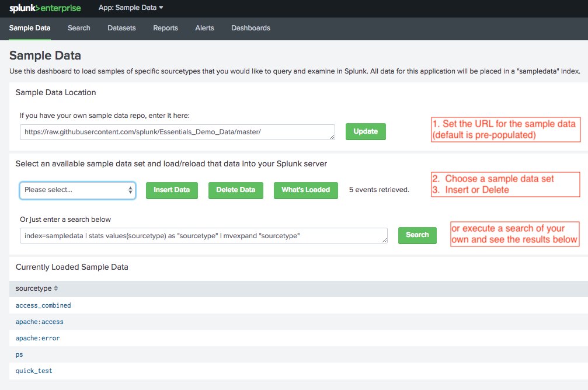
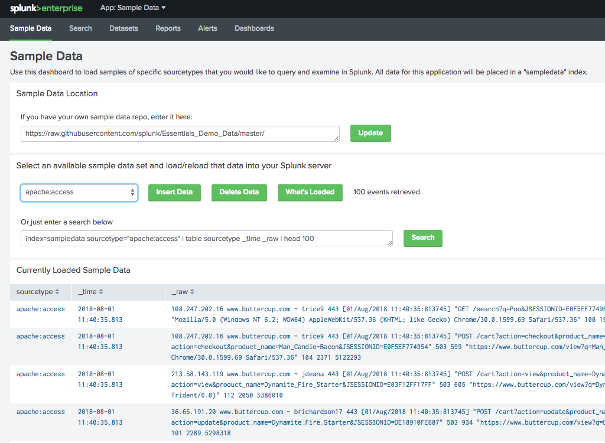

# splunk-sample-data
This repository serves as a place to store sample data files for Splunk. 

The project consists of 3 parts:
  - Configuration 
  - Data Files
  - Splunk App
  
## Configuration
In the /config subdirectory there is a single file that defines what sample data is avialable.  For each sample data file in clude a stanza in the /config/sourcetypes.json file:
```
{
    "data_sourcetype": "<your sourcetype name>",
    "sample_filename": "<your filename>",
    "parse_method":"<line | array>"
}
```

## Data Files
All sample data files reside in the /data subdirectory.  The files can be either flat files or JSON arrays.

## Splunk App
In the /splunk_app subdirectory you will find a Splunk app that you can deploy in your Splunk instance.  This app can read the files from github and insert the sample data into your Splunk instance.   The app will create a "sampledata" index where all data will be placed in your environment.   

## Notes:  
1.  The data that is loaded will all be loaded with the current timestamp of the Insertion.   If you would like to see a timeline of data, simply insert the sample data multiple times.
2.  The size of the data to be inserted is limited by the available resources of your browser.  If sample files a rather large, you may see some data dropped on the insertion.   Testing with files under 5 MB/5000 lines of text has proven to be successful. 

# Main Dashboard Screenshots
#### Instructions
<a href="images/overview.png" rel="Insctructions Screenshot"></a>

#### Data View
<a href="images/data.png" rel="Data Screenshot"></a>

